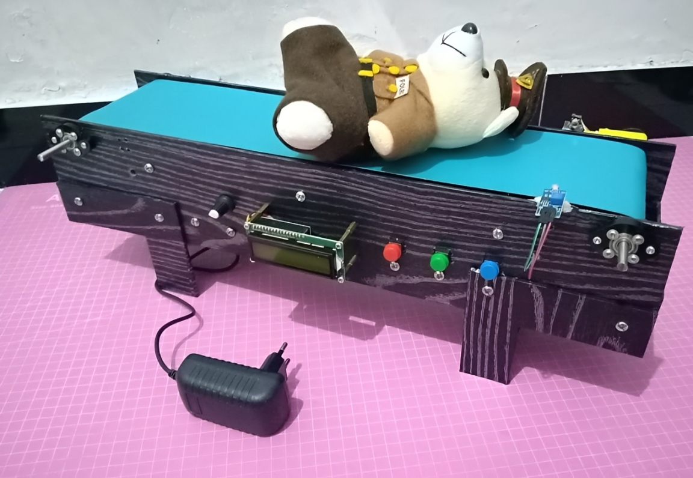

[](https://github.com/ellerbrock/open-source-badges/)
[](https://opensource.org/licenses/MIT)


# Conveyor with PWM Speed and Item Counting
Proyek ini menggabungkan konveyor mini dengan sistem penghitung barang otomatis. Sistem ini terdiri dari dua papan mikrokontroler (Arduino Pro Mini dan STM8S103F3P6), yang masing-masing bekerja secara independen namun tetap saling melengkapi satu sama lain. Arduino Pro Mini bertanggung jawab atas pengendalian motor konveyor, termasuk pengaturan kecepatan dan arah putaran motor. STM8S103F3P6 berfungsi sebagai modul penghitung barang otomatis yang menampilkan hasil perhitungan secara lokal melalui LCD I2C.

Kecepatan konveyor diatur menggunakan potensiometer, sedangkan arah putaran motor dikendalikan melalui push button. Penghitungan barang dilakukan menggunakan laser dan sensor LDR. Ketika barang menghalangi pancaran laser, sistem akan mendeteksinya dan menambahkan jumlah hitungan yang kemudian ditampilkan pada LCD. Proyek ini diharapkan dapat menjadi solusi otomasi yang sederhana dan terjangkau untuk meningkatkan efisiensi serta mengurangi kesalahan dalam penghitungan barang, sekaligus menjadi media pembelajaran mengenai kendali motor, sensor, dan sistem tertanam yang dapat dikembangkan lebih lanjut untuk kebutuhan otomasi industri.

<br><br>

## Kebutuhan Proyek
| Bagian | Deskripsi |
| --- | --- |
| Papan Pengembangan | • Arduino Pro Mini<br>• STM8S103F3P6 |
| Editor Kode | Arduino IDE 1.8.19 (Versi Lama yang Stabil) |
| Alat Pemrogram | • USB PL2303<br>• USB FTDI (Alternatif USB PL2303)<br>• ST-Link/V2 |
| Alat Komunikasi Serial | USB FTDI |
| Driver | • PL2303 USB Driver<br>• ST-Link USB Driver<br>• CDM FTDI USB Driver |
| Protokol Komunikasi | Inter Integrated Circuit (I2C) |
| Bahasa Pemrograman | C/C++ |
| Pustaka Arduino | LiquidCrystal_I2C (bawaan) |
| Aktuator | Gear Motor / Motor DC (x1) |
| Sensor | • Modul Sensor LDR (x1)<br>• KY-008: Modul Pemancar Laser 5V (x1) |
| Layar | LCD I2C (x1) |
| Komponen Lainnya| • Kabel USB Mini - USB tipe A (x1)<br>• Kabel jumper (1 set)<br>• PCB Dot Matrix Single Layer 10cm x 22cm (x1)<br>• Adaptor DC 5V 2A (x1)<br>• Adaptor DC 12V 2A (x1)<br>• Motor driver L298N (x1)<br>• Potensiometer (x1)<br>• Tombol tekan 12 x 12 mm (x3)<br>• PVC Lembaran 3 mm 10 x 50 cm (x5)<br>• Beton Baja Stainless Steel 30 cm (x1)<br>• Bantalan Bearing 6mm (x3)<br>• Pipa 1/2 Inchi 25 cm (x1)<br>• Kain Oscar 50 x 137 cm (x1)<br>• Stiker kayu (x2)<br>• Baut plus (1 set)<br>• Mur (1 set)<br>• Braket L (x24)<br>• Isolasi listrik PVC (x3)<br>• Sandpaper G-180 1 m (x1)<br>• Velg Smart Car (x1)<br>• Hexagonal Spacer Female to Female M3 x 12 (x4)<br>• Hexagonal Spacer Female to Male M3 x 20 (x4)<br>• Baut M3 x 8 (x8)<br>• Baut M3 x 20 (x12)<br>• Baut M3 x 30 (x2)<br>• Baut M5 x 25 (x8)<br>• Baut M5 x 20 (x32)<br>• Mur M3 (x14)<br>• Mur M5 (x40) |

<br><br>

## Unduh & Instal
1. Arduino IDE

   <table><tr><td width="810">

   ```
   https://bit.ly/ArduinoIDE_Installer
   ```

   </td></tr></table><br>

2. PL2303 USB Driver

   <table><tr><td width="810">
   
   ```
   https://bit.ly/PL2303P_USBdriver
   ```

   </td></tr></table><br>

3. ST-Link USB Driver

   <table><tr><td width="810">
   
   ```
   https://bit.ly/STLink_USBdriver
   ```

   </td></tr></table><br>
   
4. CDM FTDI USB Driver

   <table><tr><td width="810">
   
   ```
   https://bit.ly/CDM_FTDI_USBdriver
   ```

   </td></tr></table>
   
<br><br>

## Rancangan Proyek
<table>
<tr>
<th width="420">Diagram Blok</th>
<th width="420">Diagram Ilustrasi</th>
</tr>
<tr>
<td></td>
<td></td>
</tr>
</table>
<table>
<tr>
<th width="840">Pengkabelan</th>
</tr>
<tr>
<td></td>
</tr>
</table>

<br><br>

## Memindai Alamat I2C Yang Ada Pada LCD
<table><tr><td width="840">

```ino
/*
  =====================================================
  I2C Scanner untuk STM8S103F3P6
  by: Devan Cakra Mudra Wijaya, S.Kom.
  =====================================================

  Fungsi:
  - Mendeteksi seluruh perangkat I2C yang terhubung
  - Menampilkan alamat perangkat dalam format HEX
  - Menampilkan jumlah perangkat yang ditemukan


  =====================================================
  Pin SDA dan SCL untuk STM8S103F3P6
  =====================================================
  SDA -> PB5
  SCL -> PB4
*/

// Memanggil library I2C untuk komunikasi I2C
#include "I2C.h"

// Konstanta untuk menentukan jeda antar scan (5000 ms = 5 detik)
const uint16_t SCAN_INTERVAL = 5000;


// Fungsi setup() dijalankan satu kali saat board pertama kali menyala atau reset
// Digunakan untuk inisialisasi perangkat keras, komunikasi serial, sensor, modul, dan konfigurasi awal program
void setup() {

  // Memulai komunikasi Serial dengan baud rate 9600
  Serial_begin(9600);

  // Menunggu selama 5 detik sebelum program dimulai
  delay(5000);

  // Menampilkan header program
  Serial_println_s("====================================");
  Serial_println_s("         I2C DEVICE SCANNER         ");
  Serial_println_s("by: Devan Cakra Mudra Wijaya, S.Kom.");
  Serial_println_s("====================================");

  // Mencetak baris kosong
  Serial_println_s("");

  // Menginisialisasi komunikasi I2C
  I2C_begin();
}


// Fungsi loop() dijalankan terus-menerus setelah Fungsi setup() selesai
// Seluruh logika utama program biasanya ditempatkan di dalam fungsi ini
void loop() {

  // Variabel untuk menyimpan kode error hasil komunikasi I2C
  uint8_t error;

  // Variabel untuk menyimpan alamat I2C yang sedang diperiksa
  uint8_t address;

  // Variabel penghitung jumlah device yang ditemukan
  uint8_t deviceCount = 0;

  // Menampilkan informasi bahwa proses scan dimulai
  Serial_println_s("------------------------------------");
  Serial_println_s("Scanning I2C bus...");
  Serial_println_s("------------------------------------");

  // Melakukan perulangan dari alamat 1 sampai 126
  // Alamat I2C valid adalah 0x01 sampai 0x7E
  for (address = 1; address < 127; address++) {

    // Melakukan transaksi penulisan I2C (driver I2C STM8)
    // Digunakan untuk menguji respons ACK dari perangkat
    // Kode kesalahan bergantung pada implementasi driver I2C
    error = I2C_write(address, 0x00);

    // Jika tidak ada error, maka:
    if (error == 0) {

      // Menampilkan informasi device ditemukan
      Serial_print_s("[FOUND] Device at address 0x");

      // Jika alamat kurang dari 16, maka:
      // Tambahkan angka 0 di depan agar format HEX rapi
      if (address < 16) {
        Serial_print_s("0");
      }

      // Menampilkan alamat dalam format HEX
      Serial_print_ub(address, HEX);
      Serial_println_s("");

      // Menambah jumlah device yang ditemukan
      deviceCount++;
    }

    // Jika terjadi error tidak dikenal, maka:
    else if (error == 4) {

      // Menampilkan pesan error
      Serial_print_s("[ERROR] Unknown error at address 0x");

      // Jika alamat kurang dari 16, maka:
      // Tambahkan angka 0 di depan agar format HEX rapi
      if (address < 16) {
        Serial_print_s("0");
      }

      // Menampilkan alamat yang bermasalah dalam format HEX
      Serial_print_ub(address, HEX);
      Serial_println_s("");
    }

    // Jika error selain 0 atau 4, maka:
    // Diabaikan, biasanya ini terjadi karena tidak ada perangkat pada alamat tersebut
  }

  // Mencetak baris kosong
  Serial_println_s("");

  // Jika tidak ada device ditemukan, maka:
  if (deviceCount == 0) {

    // Tampilkan pesan tidak ada device
    Serial_println_s("No I2C devices found.");
  }
  else { // Jika setidaknya satu perangkat ditemukan, maka:

    // Menampilkan jumlah device yang ditemukan
    Serial_print_s("Total devices found: ");

    // Menampilkan nilai deviceCount
    Serial_print_ub(deviceCount, DEC);
    Serial_println_s("");
  }

  // Menampilkan informasi waktu scan berikutnya
  Serial_print_s("Next scan in ");

  // Mengubah milidetik menjadi detik
  Serial_print_ub(SCAN_INTERVAL / 1000, DEC);

  // Menampilkan satuan detik
  Serial_println_s(" seconds.");

  // Baris kosong
  Serial_println_s("\n");

  // Menunggu selama 5 detik sebelum scan ulang
  delay(SCAN_INTERVAL);
}
```

</td></tr></table><br><br>

## Memulai
1. Unduh dan ekstrak repositori ini.<br><br>
   
2. Pastikan anda memiliki komponen elektronik yang diperlukan.<br><br>
   
3. Pastikan komponen anda telah dirancang sesuai dengan diagram.<br><br>
    
4. Konfigurasikan perangkat anda menurut pengaturan di atas.<br><br>

5. Selamat menikmati [Selesai].

<br><br>

## Sorotan


<br><br>

## Apresiasi
Jika karya ini bermanfaat bagi anda, maka dukunglah karya ini sebagai bentuk apresiasi kepada penulis dengan mengklik tombol ``` ⭐Bintang ``` di bagian atas repositori.

<br><br>

## Penafian
Aplikasi ini merupakan hasil karya saya sendiri dan bukan merupakan hasil plagiat dari penelitian atau karya orang lain, kecuali yang berkaitan dengan layanan pihak ketiga yang meliputi: pustaka, kerangka kerja, dan lain sebagainya.

<br><br>

## LISENSI
LISENSI MIT - Hak Cipta © 2026 - Devan C. M. Wijaya, S.Kom

Dengan ini diberikan izin tanpa biaya kepada siapa pun yang mendapatkan salinan perangkat lunak ini dan file dokumentasi terkait perangkat lunak untuk menggunakannya tanpa batasan, termasuk namun tidak terbatas pada hak untuk menggunakan, menyalin, memodifikasi, menggabungkan, mempublikasikan, mendistribusikan, mensublisensikan, dan/atau menjual salinan Perangkat Lunak ini, dan mengizinkan orang yang menerima Perangkat Lunak ini untuk dilengkapi dengan persyaratan berikut:

Pemberitahuan hak cipta di atas dan pemberitahuan izin ini harus menyertai semua salinan atau bagian penting dari Perangkat Lunak.

DALAM HAL APAPUN, PENULIS ATAU PEMEGANG HAK CIPTA DI SINI TETAP MEMILIKI HAK KEPEMILIKAN PENUH. PERANGKAT LUNAK INI DISEDIAKAN SEBAGAIMANA ADANYA, TANPA JAMINAN APAPUN, BAIK TERSURAT MAUPUN TERSIRAT, OLEH KARENA ITU JIKA TERJADI KERUSAKAN, KEHILANGAN, ATAU LAINNYA YANG TIMBUL DARI PENGGUNAAN ATAU URUSAN LAIN DALAM PERANGKAT LUNAK INI, PENULIS ATAU PEMEGANG HAK CIPTA TIDAK BERTANGGUNG JAWAB, KARENA PENGGUNAAN PERANGKAT LUNAK INI TIDAK DIPAKSAKAN SAMA SEKALI, SEHINGGA RISIKO ADALAH MILIK ANDA SENDIRI.
